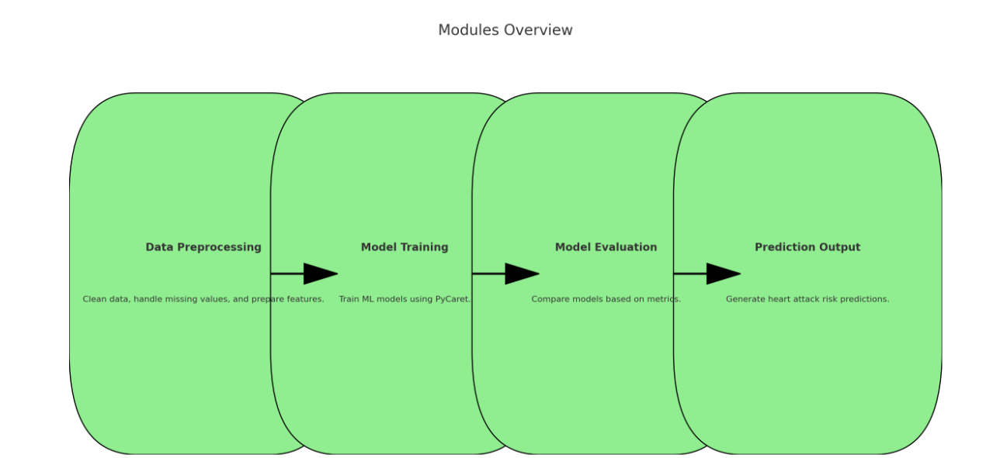
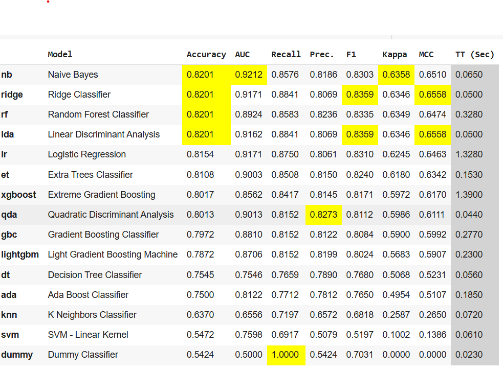
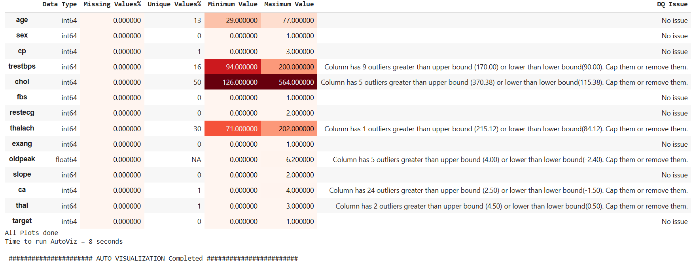

❤️ Heart Attack Prediction using PyCaret
📌 Overview
This project uses PyCaret, a low-code machine learning library, to predict the risk of a heart attack based on patient health data. The model is trained on medical features like age, cholesterol levels, blood pressure, and lifestyle habits to provide an accurate risk assessment.

📊 Dataset
The dataset contains key health indicators such as:

Age 🏥
Cholesterol Levels 🩸
Blood Pressure ❤️
Heart Rate 💓
Diabetes History 🔬
Smoking & Alcohol Consumption 🚬🍷
Obesity & Exercise Habits 🏃
🛠️ Tech Stack
Python 🐍
PyCaret (for AutoML) ⚡
Pandas & NumPy (data processing) 📊
Matplotlib & Seaborn (visualization) 📈
Scikit-learn (model evaluation) 🤖
🚀 How to Run the Project
1️⃣ Install dependencies

bash
Copy
Edit
pip install pycaret pandas numpy matplotlib seaborn
2️⃣ Run the Jupyter Notebook / Python Script

bash
Copy
Edit
jupyter notebook
3️⃣ Train the Model with PyCaret

Load the dataset
Use PyCaret’s Classification Module to train multiple models
Select the best-performing model
Evaluate its accuracy & performance
📈 Model Performance
The model achieves high accuracy in predicting heart attack risks. The evaluation metrics include:
✅ Accuracy
✅ Precision & Recall
✅ F1 Score
✅ ROC-AUC Curve

📸 Screenshots  
🖼️ Process  
  

🖼️ Performance Metrics  
  

🖼️ Auto Visualization  
  

📌 Future Enhancements
🔹 Improve accuracy with Hyperparameter Tuning
🔹 Deploy the model using Flask / Streamlit for real-world usage
🔹 Integrate a Web Dashboard for patient data input

📜 License
This project is open-source under the MIT License.

⭐ Contribute
If you find this useful, feel free to fork, improve, and contribute! 😊

